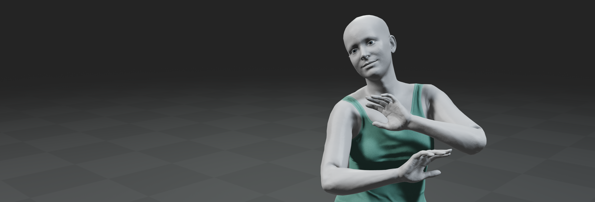
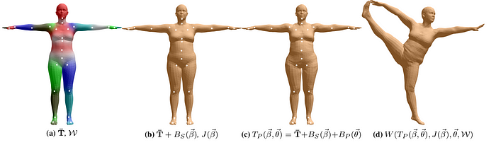

# Smpl-rs

Smpl-rs is the suite of SMPL functionality implemented in Rust over [gloss](https://github.com/Meshcapade/gloss). It contains code for creating smpl-bodies, rendering and modifying them.



## Features 
- Run forward passes through the SMPL model (betas->mesh)
- Control the SMPL model with betas or with measurements(height, weight, waist, etc.)
- Interfaces with [gloss](https://github.com/Meshcapade/gloss) for rendering meshes both in native and web
<div align="center">
<p align="middle">
  
</p>
</div>


## Dependencies 
The main dependency is [gloss](https://github.com/Meshcapade/gloss) which will be downloaded and compiled automatically when building this package. 

## Installation 
### Install and run native
```sh
$ cd smpl-rs
$ cargo build
$ cargo run --bin smpl_minimal
```

### Install and Run Python 
First follow the instructions in [gloss](https://github.com/Meshcapade/gloss) to build the python package. Afterwards, you can build the smpl_python bindings with: 
```sh
$ cd smpl-rs/bindings/smpl_py
$ ./scripts/build_local.sh
$ ./examples/minimal.py
```

### Install and run Web
First install necessary dependencies
```sh
$ sudo apt install nodejs npm 
```

```sh
$ cd smpl-rs/examples/web/visualizer
$ wasm-pack build --target web
$ npm i
```
To run the web example we can create a dummy web server by opening another terminal and running:
```sh
$ cd smpl-rs/examples/web/visualizer
$ npm run start
# $ python -m http.server 
```
<!-- Finally navigate to `http://0.0.0.0:8000/smpl_webpage/` in your browser of choice. -->
Finally navigate to `http://localhost:3000/` in your browser of choice.

## Examples

Various examples can be found in the ./examples folder.\
You can run each one of them using 
```sh
$ cargo run --bin <example_name>
```

## React

Please read the file `examples/web/visualizer/README.md` 

## Info on usage
- The SMPL suite renders using [gloss](https://github.com/Meshcapade/gloss) and therefore uses an Entity-Component-System (ECS) framework. For more info on ECS check [here](https://bevyengine.org/learn/book/getting-started/ecs/). However to be noted that we use [Hecs] for our ECS system but most of them are very similar.
- Components like Animation and Measurements regressor are added to entities and that dictates which systems it uses. If you don't want animation on the avatar, just comment out the component for it when creating the entity. 
- For adding new functionality to [gloss](https://github.com/Meshcapade/gloss) we use callbacks. This is needed because on WASM the rendering loop cannot be explictly controlled.  

## Credits and Acknowledgements
- [Hecs]: <https://github.com/Ralith/hecs>
